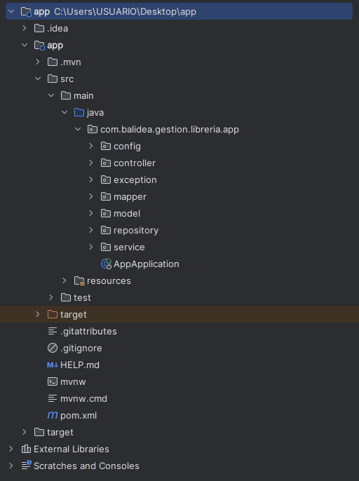

# 📚 Gestión de Librería Backend

## Descripción del Proyecto

El proyecto **Gestión de Librería** es un microservicio diseñado para gestionar libros, autores y préstamos en una librería. Incluye servicios rest para agregar, editar, eliminar y listar libros, autores y préstamos.

---

## 🛠️ Tecnologías Utilizadas

- **Lenguaje:** Java 17
- **Framework:** Spring Boot 3.2.11
- **Base de Datos:** H2 (base de datos en memoria)
- **ORM:** Spring Data JPA
- **Gestor de Dependencias:** Maven
- **Editor Recomendado:** IntelliJ IDEA

---

## Pasos para Ejecutar el Proyecto 🚀 

#### **Requisitos Previos**
- **Java JDK 17** instalado.
- **Maven** instalado.

#### **Instrucciones**

1. **Clona el repositorio:**
   ```bash
   git clone https://github.com/AngeloQP/gestion-libreria-backend.git

2. **Instalar dependencias:**

   ```bash
   mvn clean install

3. **Compila y ejecuta el backend:**

   ```bash
   mvn spring-boot:run

4. **Accede a la consola H2 (base de datos en memoria):**

   - **URL:** [http://localhost:8080/h2-console](http://localhost:8080/h2-console)
   - **Configuración:**
     - **URL JDBC:** `jdbc:h2:mem:bdLibreria`
     - **Usuario:** `sa`
     - **Contraseña:** *(dejar en blanco)*

5. **Acceder a la documentación Swagger:**

   - **URL:** [[http://localhost:8080/swagger-ui/index.html](http://localhost:8080/swagger-ui/index.html)](http://localhost:8080/api/doc/swagger-ui/index.html)


---

## 📁 Estructura del Proyecto




## 📸 Swagger


